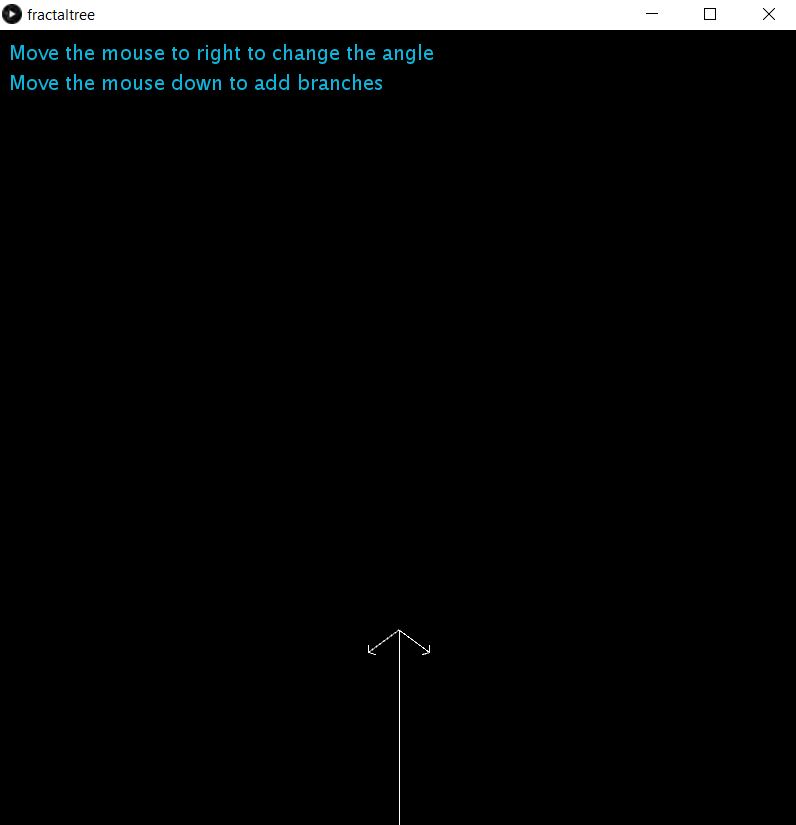
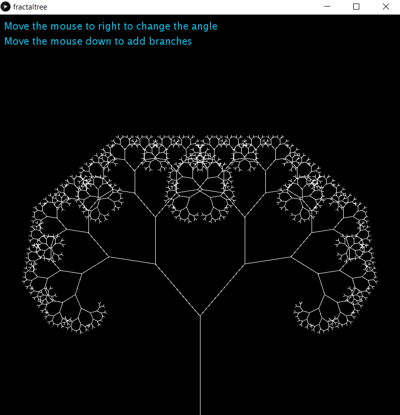

# Fractal Tree
[](LICENSE)


This simple programme is written with processing3.<br><br>
**From Wikipedia:**<br>
The word "fractal" often has different connotations for the lay public as opposed to mathematicians, where the public is more likely to be familiar with fractal art than the mathematical concept.<br>
In mathematics, a fractal is a self-similar subset of Euclidean space whose fractal dimension strictly exceeds its topological dimension.<br>
In computer science, a fractal tree index is a tree data structure that keeps data sorted and allows searches and sequential access in the same time as a B-tree but with insertions and deletions that are asymptotically faster than a B-tree. Like a B-tree, a fractal tree index is a generalization of a binary search tree in that a node can have more than two children. Furthermore, unlike a B-tree, a fractal tree index has buffers at each node, which allow insertions, deletions and other changes to be stored in intermediate locations.

## #100daysofcode
Almost a hundred days ago from now (01/10/2020), I decided to do the #100daysofcode challenge. This challenge is simply for someone to code every day and post on social media a picture shows that he wrote a code (every day). And than they share with us the final project.<br>
But me..! I did it differently, every day I built apps, games, web pages or desktop apps. Every day something new and I shared all my apps simulation on my Instagram account (you can see my highlight stories), click <a href='https://instagram.com/medyanis_hiou' target='_blank'>here</a> if you wanna see it. And than I'll mix all my small apps in one big project. So I decided to share all the projects with you.<br><br>
PS: You can check all my project <a href='http://y100daysofcode.ml' target='_blank'>here</a><br>

## Features :dart:
* [x] Free & Open Source
* [x] Very Easy to use
* [x] No Internet connection required

## Thank _You_!
Please :star: this repo to help us improve the quality.

## Screenshots
Begin          | Playing
:---------------------:|:------------------:
 |  <br>

## Requirements
* processing3

## How To Use It
1. Download Processing3 from this link: https://processing.org/download/
2. Install this repository, click <a href="https://github.com/mohamedyanis/3D-Slicingfractal-tree/archive/master.zip"> here </a> to install it.
3. Extract the folder.
4. Open the ```shoot_game.pde``` file.
5. Run it :)

## Options
* [x] Move the mouse to right to change the angle
* [x] Move the mouse down to add branches

## Contributing 💡
If you want to contribute to this project and make it better with new ideas, your pull request is very welcomed.<br>
If you find any issue just put it in the repository issue section, thank!<br><br>
.سبحَانَكَ اللَّهُمَّ وَبِحَمْدِكَ، أَشْهَدُ أَنْ لا إِلهَ إِلأَ انْتَ أَسْتَغْفِرُكَ وَأَتْوبُ إِلَيْكَ
